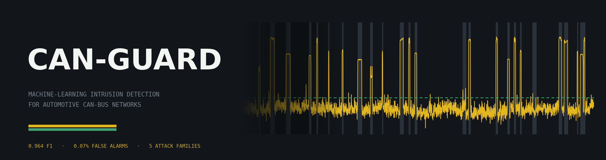
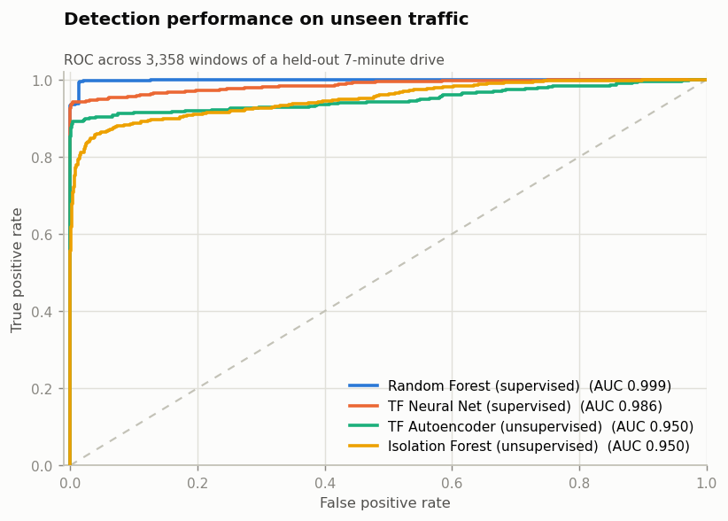
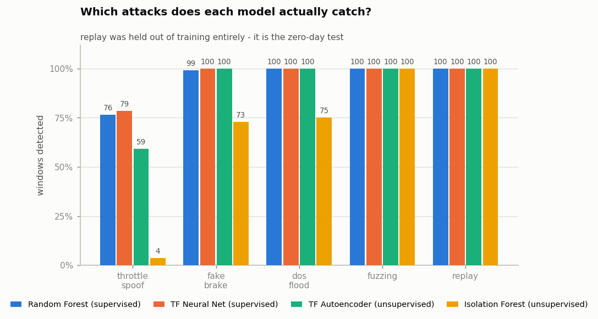
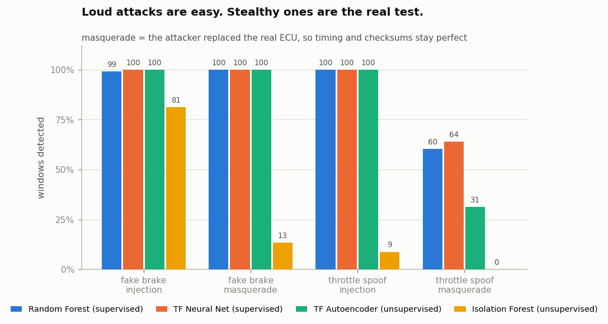
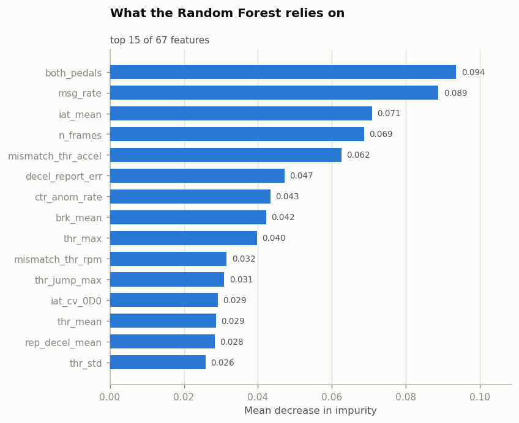
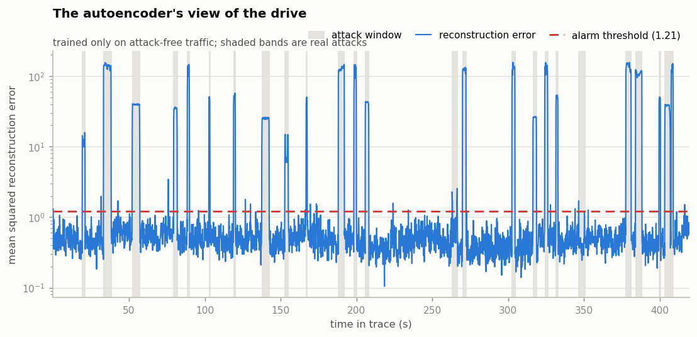
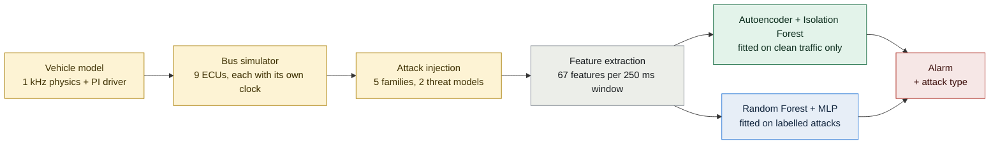

<div align="center">



<br>

[](LICENSE)
[](https://www.python.org/downloads/)
[](https://www.tensorflow.org/)
[](https://scikit-learn.org/)
[](tests/)
[](#reproducibility)

**A modern car is fifty to a hundred computers sharing one broadcast wire with no authentication.**
**Anything that can transmit can claim to be the brake controller. CAN-Guard notices when something does.**

[Results](#results) · [How it works](#how-it-works) · [Quick start](#quick-start) · [Limitations](#limitations-the-part-worth-reading) · [Licence](#licence)

</div>

---

## What this is

CAN-Guard is an intrusion detection system for the Controller Area Network bus
inside a vehicle. It watches the traffic, learns what a healthy bus looks like
while the car is driven normally, and raises an alarm when the messages stop
agreeing with each other or with physics.

It detects five families of attack — unauthorized throttle commands, forged
brake signals, denial-of-service floods, fuzzing sweeps and replayed recordings
— under **two threat models**, including the stealthy one where the attacker
silences the real ECU and transmits in its place with perfect timing.

The whole thing runs offline on a laptop in about two minutes. There is no
cloud service, no GPU, no account, and no dataset to buy: a physics-based
vehicle and bus simulator generates the traffic, so every result here
reproduces from a clean checkout.

```
 ▸ pip install -r requirements.txt
 ▸ python run_all.py
```

---

## Results

Measured on a held-out seven-minute drive the models never saw during training
— **3,358 windows of bus traffic, 523 of them containing an attack.**

<table>
<tr><th align="left">Model</th><th>Accuracy</th><th>Precision</th><th>Recall</th><th>F1</th><th>ROC-AUC</th><th>False alarms</th></tr>
<tr><td align="left"><b>Random Forest</b> <sub>supervised</sub></td><td align="center">0.989</td><td align="center">0.996</td><td align="center">0.935</td><td align="center"><b>0.964</b></td><td align="center">0.9989</td><td align="center"><b>0.07%</b></td></tr>
<tr><td align="left"><b>TensorFlow neural net</b> <sub>supervised</sub></td><td align="center">0.984</td><td align="center">0.954</td><td align="center">0.943</td><td align="center">0.948</td><td align="center">0.9856</td><td align="center">0.85%</td></tr>
<tr><td align="left"><b>TensorFlow autoencoder</b> <sub>unsupervised</sub></td><td align="center">0.975</td><td align="center">0.945</td><td align="center">0.891</td><td align="center">0.917</td><td align="center">0.9495</td><td align="center">0.95%</td></tr>
<tr><td align="left"><b>Isolation Forest</b> <sub>classical baseline</sub></td><td align="center">0.945</td><td align="center">0.980</td><td align="center">0.660</td><td align="center">0.789</td><td align="center">0.9501</td><td align="center">0.25%</td></tr>
</table>

Once an attack is detected, a separate TensorFlow classifier names it:
**93.5% accuracy across six classes.**



### Detection by attack family

| Model | throttle&nbsp;spoof | fake&nbsp;brake | DoS&nbsp;flood | fuzzing | replay&nbsp;⁽ᶻᵈ⁾ |
|:---|:---:|:---:|:---:|:---:|:---:|
| Random Forest | 76.4% | 99.2% | 100% | 100% | **100%** |
| TF neural net | 78.6% | 100% | 100% | 100% | **100%** |
| TF autoencoder | 59.3% | 100% | 100% | 100% | **100%** |
| Isolation Forest | 3.6% | 73.0% | 75.0% | 100% | **100%** |

⁽ᶻᵈ⁾ **`replay` is excluded from training entirely.** It is the zero-day test.
Every model catches it at 100% having never seen one, which is the argument for
keeping an anomaly detector next to a classifier rather than instead of it.



### Detection by threat model — where it actually gets hard

Published CAN-IDS numbers tend to look perfect because they only test
**injection**: the attacker adds frames, the message rate for that ID roughly
doubles, and the rolling counters fall apart. Anything detects that.

The real problem is **masquerade**. The attacker first silences the genuine ECU
with a bus-off attack, then transmits in its place — correct cycle time, correct
rolling counter, valid checksum. Nothing about the *traffic* is wrong. The only
thing that betrays it is that the car does not behave the way the frames claim.

| Model | throttle spoof<br><sub>injection</sub> | throttle spoof<br><sub>**masquerade**</sub> | fake brake<br><sub>injection</sub> | fake brake<br><sub>**masquerade**</sub> |
|:---|:---:|:---:|:---:|:---:|
| Random Forest | 100% | **60.2%** | 99.1% | 100% |
| TF neural net | 100% | **63.9%** | 100% | 100% |
| TF autoencoder | 100% | **31.3%** | 100% | 100% |
| Isolation Forest | 8.8% | **0.0%** | 81.3% | 13.3% |

A stealthy throttle spoof is the one case where the traffic statistics genuinely
look normal, and the numbers say so instead of hiding it. The supervised models
survive because they were given physics residuals to learn from; the autoencoder,
which only ever saw clean traffic, does not.



### What the detector is actually looking at



The top features come from all four families — timing (`msg_rate`, `iat_mean`),
integrity (`ctr_anom_rate`), and physics (`both_pedals`, `mismatch_thr_accel`,
`decel_report_err`). No single signal carries the detection, which is the
property you want: an attacker who defeats one of them still trips the others.



The autoencoder's view of the same drive. It was trained only on attack-free
traffic; the shaded bands are the real attack episodes, and everything above the
dashed line is an alarm.

---

## How it works



The left half is the testbed and the right half is the detector. They are kept
strictly apart: the models never see the simulator's internal state, only the
frames it put on the wire.

<details>
<summary><b>1 · A simulated vehicle, not random numbers</b></summary>

<br>

`canguard/vehicle.py` runs a longitudinal vehicle model at 1 kHz — engine force,
brake force, aerodynamic drag, gear selection, driveline ratios, engine inertia —
driven by a PI "driver" following a randomly generated urban speed profile with
stops, pull-aways, cruising and hard braking.

This is the load-bearing decision of the whole project. If the signals were
random, a spoofed throttle value would be statistically indistinguishable from a
real one and there would be nothing to learn. Because the signals obey physics, a
throttle message claiming 80% pedal while the wheels are not accelerating and the
RPM is flat becomes *detectably impossible*.

</details>

<details>
<summary><b>2 · A bus that behaves like a bus</b></summary>

<br>

`canguard/config.py` defines nine periodic messages modelled on a 500 kbit/s
powertrain bus:

| ID | Message | Cycle | Counter + checksum |
|:---|:---|:---:|:---:|
| `0x0C0` | ENGINE_RPM | 10 ms | ✓ |
| `0x0D0` | THROTTLE | 20 ms | ✓ |
| `0x1A0` | BRAKE | 20 ms | ✓ |
| `0x1D0` | WHEEL_SPEED | 10 ms | ✓ |
| `0x2C0` | STEERING | 20 ms | |
| `0x3B0` | GEAR | 50 ms | |
| `0x4B1` | ABS_ESP | 20 ms | |
| `0x5A0` | BODY_STATUS | 100 ms | |
| `0x7E8` | OBD2_RESP | 200 ms | |

Every ECU has its own clock with its own jitter, and each schedules from the
instant it *meant* to transmit rather than from when it got around to it — a
subtlety the test suite enforces, because rounding each cycle up to the next tick
biases every period by half a millisecond and the timing features would learn
that bias as normal.

Payloads are packed as real binary signals (`canguard/signals.py`), four of them
carrying a rolling counter and a checksum. The output is a candump-shaped CSV:

```csv
t,can_id,dlc,data,label,attack
12.403,1D0,8,0CEC0CE70CF00624,0,0
12.410,0C0,8,22BF895E00000141,0,0
12.412,4B1,8,0019002800000000,0,0
12.414,1A0,8,0000005A000004F1,0,0
```

</details>

<details>
<summary><b>3 · Five attack families, two threat models</b></summary>

<br>

| Attack | What the attacker does |
|:---|:---|
| `throttle_spoof` | THROTTLE frames claim a pedal position the driver never asked for |
| `fake_brake` | Forged brake pressure; half the attackers also fake the brake-light bit in BODY_STATUS |
| `dos_flood` | Floods ID `0x000` — the highest arbitration priority — starving every real ECU |
| `fuzzing` | Random IDs, random payloads |
| `replay` | Perfectly valid frames recorded earlier, played back out of context |

The two spoofing attacks each run in **injection** and **masquerade** mode, and
both ramp their signal smoothly rather than jumping frame to frame. That last
detail matters more than it looks: an attacker who stepped the pedal from 0 to 80
instantly would be detectable from the jitter alone, and the project would be
measuring its own artefact rather than the attack.

</details>

<details>
<summary><b>4 · 67 features per 250 ms of traffic</b></summary>

<br>

`canguard/features.py` turns each 250 ms window (50% overlap) into 67 numbers.
Each family exists because a specific class of attack breaks it:

| Family | Examples | Broken by |
|:---|:---|:---|
| **Timing** | message rate, inter-arrival statistics, per-ID count ratio against the expected cycle, per-ID timing CV | injection, DoS, fuzzing, replay |
| **Integrity** | rolling-counter continuity, checksum failures, duplicate payloads, bit-flip churn, payload entropy | injection, fuzzing, replay |
| **Physics** | throttle vs. measured acceleration, throttle vs. RPM slope, brake pressure vs. actual deceleration, reported vs. real deceleration, RPM vs. what the gear and wheel speed imply, both pedals at once | **masquerade**, replay |
| **Cross-ECU** | brake pressure vs. the body controller's brake-light bit | any single-ECU spoof |

</details>

<details>
<summary><b>5 · Four models answering two different questions</b></summary>

<br>

| Question | Model | Trained on |
|:---|:---|:---|
| *Is this normal?* | TensorFlow autoencoder — 67 → 48 → 24 → **8** → 24 → 48 → 67 | attack-free traffic **only** |
| *Is this normal?* | Scikit-learn Isolation Forest | attack-free traffic **only** |
| *Is this an attack?* | Scikit-learn Random Forest, 400 trees | labelled traffic |
| *Which attack?* | TensorFlow MLP, 6-class softmax | labelled traffic |

The autoencoder is what "establishes a baseline of behaviour": it learns to
rebuild a normal window from an eight-number bottleneck. Traffic it has never
seen rebuilds badly, and that reconstruction error is the alarm. The threshold is
the 99th percentile of reconstruction error on a slice of clean traffic the
autoencoder never fitted — so it is calibrated, not guessed.

</details>

<details>
<summary><b>6 · Online detection, not just a saved matrix</b></summary>

<br>

`scripts/5_live_detect.py` replays a trace frame by frame the way a gateway would
see it, keeps a rolling 250 ms buffer, re-scores every 125 ms, and debounces the
alarm over the last three windows the way a real IDS does:

```
  t=  19.63s  ALERT  classifier 0.82 -> fake_brake; anomaly 12.6 (> 1.2)     [ok]
  t=  33.63s  ALERT  classifier 0.99 -> fuzzing; anomaly 137.7 (> 1.2)       [ok]
  t= 103.13s  ALERT  classifier 0.94 -> dos_flood; anomaly 51.9 (> 1.2)      [ok]
  t= 138.00s  ALERT  classifier 0.97 -> throttle_spoof; anomaly 20.6 (> 1.2) [ok]

  2,078 windows scored   alarms 279   correct 257   false 22   missed 10
```

The `[ok]` / `false alarm` / `missed` tags are the ground truth printed alongside
each decision, so the demo grades itself as it runs rather than just looking
impressive.

```bash
python scripts/5_live_detect.py                  # replay at 8× real time
python scripts/5_live_detect.py --speed 0        # as fast as the CPU allows
python scripts/5_live_detect.py --confirm 1      # no debounce, see every flag
```

</details>

---

## Quick start

```bash
git clone https://github.com/yourname/can-guard.git
cd can-guard

python -m venv .venv
source .venv/bin/activate          # Windows: .venv\Scripts\Activate.ps1
pip install -r requirements.txt

python run_all.py                  # ~2 minutes, generates everything
python scripts/5_live_detect.py    # watch it detect in real time
```

Or one stage at a time:

| Command | What it does | Time |
|:---|:---|:---:|
| `python scripts/1_generate_data.py` | drives a simulated car, records the bus, injects the attacks | ~45 s |
| `python scripts/2_extract_features.py` | 250 ms windows → 67-feature rows | ~15 s |
| `python scripts/3_train.py` | fits all four detectors plus the type classifier | ~45 s |
| `python scripts/4_evaluate.py` | scores on unseen traffic, writes the charts | ~20 s |
| `python scripts/5_live_detect.py` | streaming detection demo | interactive |

**Requirements:** Python 3.9–3.13, 64-bit, about 3 GB of disk. No GPU. Internet
is needed once, to install the libraries.

### Tests

```bash
pip install -r requirements-dev.txt
pytest -q                          # 59 tests, ~40 s
ruff check .
```

The suite is not decoration — it asserts that each ECU holds its cycle time,
that clean traffic never trips a counter or checksum, that masquerade frames keep
valid checksums (or the hard case would not be hard), and that the physics
mismatch features actually separate attacks from normal driving. It has already
caught one real bug in the bus scheduler.

### Reproducibility

Every random seed is fixed and TensorFlow op determinism is enabled, so the
tables above reproduce **bit for bit** on any machine. CI re-runs the entire
pipeline on every push and fails if the headline F1 drops below 0.94.

---

## Project layout

```
can-guard/
├── canguard/
│   ├── config.py        bus definition: IDs, cycle times, vehicle constants
│   ├── vehicle.py       longitudinal physics + a PI driver
│   ├── signals.py       payload encode/decode, rolling counters, checksums
│   ├── simulator.py     per-ECU clocks → one interleaved frame stream
│   ├── attacks.py       five attack families, two threat models
│   ├── features.py      67 features per 250 ms window
│   ├── models.py        the four detectors
│   ├── dataset.py       candump-style CSV I/O
│   └── viz.py           chart styling
├── scripts/             the five pipeline stages
├── tests/               59 tests covering signals, bus, features, detection
├── tools/               README banner generator
├── data/                generated traces and feature matrices
├── models/              trained models + the calibrated alarm threshold
└── reports/             charts, metrics.json, metrics.csv
```

---

## Limitations — the part worth reading

Every project like this has these. Most README files leave them out.

- **The data is simulated.** The physics and bus timing are modelled carefully,
  but a real vehicle has more ECUs, diagnostic sessions, transient bus errors and
  far messier idle behaviour. Numbers on real traffic would be lower.
- **Stealthy throttle spoofing is only ~60% caught**, and that is the attack you
  would most want to catch. The traffic statistics genuinely look normal; only
  the physics residual separates it, and only when the driver is not already
  accelerating.
- **The brake-light cross-check assumes** the body controller is independent of
  the brake ECU. On some vehicles it is not — which is why half the simulated
  masquerade attackers spoof that bit too.
- **Windowed detection has latency.** An alarm arrives at best 250 ms after the
  attack starts, and the debounce adds another 250 ms. For a throttle attack that
  is probably acceptable; for a brake attack it is a design decision worth
  arguing about.
- **The physics features need a DBC.** An OEM has one; an aftermarket dongle does
  not. Without it you are left with timing and integrity, and masquerade
  detection collapses — see the Isolation Forest row, which is roughly what that
  world looks like.
- **This is not a safety system.** See [SECURITY.md](SECURITY.md) before going
  anywhere near a real vehicle.

## Using real data

The pipeline reads a plain CSV of `t, can_id, dlc, data, label, attack`. To run
against the HCRL Car-Hacking dataset or your own `candump` log, convert it to
that shape, drop it in `data/`, and skip stage 1. The physics features will be
mostly empty unless you also supply a DBC for the vehicle, so expect timing and
integrity to carry the detection.

---

## Documentation

| File | What it covers |
|:---|:---|
| [CONTRIBUTING.md](CONTRIBUTING.md) | How to add an attack or a feature without accidentally making the problem easier |
| [SECURITY.md](SECURITY.md) | Scope, safe-use boundaries, and how to report a vulnerability |
| [CHANGELOG.md](CHANGELOG.md) | Version history |
| [THIRD_PARTY_NOTICES.md](THIRD_PARTY_NOTICES.md) | Every dependency and its licence |
| [CODE_OF_CONDUCT.md](CODE_OF_CONDUCT.md) | Contributor Covenant 2.1 |

## Licence

Released under the **[MIT Licence](LICENSE)** — © 2026 i5 Designs. Use it
commercially, modify it, redistribute it; just keep the copyright notice.

All six dependencies are permissively licensed and compatible with MIT (BSD-3,
Apache-2.0, and the Matplotlib licence). Nothing here is copyleft, and no
proprietary dataset, DBC file or vehicle log is used, bundled or required — see
[THIRD_PARTY_NOTICES.md](THIRD_PARTY_NOTICES.md) for the full breakdown.

The bus layout and signal scaling are modelled on publicly documented properties
of automotive CAN (ISO 11898, SAE J1979 / OBD-II mode 01) and on published
CAN-IDS literature. They are an illustrative approximation, **not** any
manufacturer's database.

## Citation

```bibtex
@software{canguard2026,
  title  = {CAN-Guard: machine-learning intrusion detection for
            automotive CAN-bus networks},
  author = {{Lohit Shanmugam}},
  year   = {2026},
  url    = {https://github.com/yourname/can-guard},
  license = {MIT}
}
```

A machine-readable [`CITATION.cff`](CITATION.cff) is included, so GitHub's
"Cite this repository" button works out of the box.

<div align="center">
<br>
<sub>Replace <code>yourname</code> with your GitHub username in this file,
<code>CITATION.cff</code>, <code>CHANGELOG.md</code> and <code>.github/</code> —
one find-and-replace and every link resolves.</sub>
</div>
